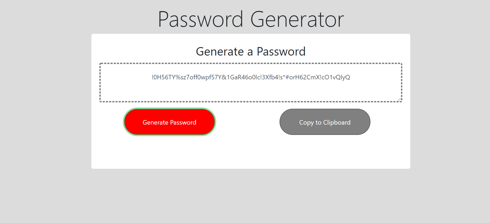

# barakai.github.io
 
 **Password Generator**

 This application is created using using Html , Css and JavaScript. The application helps th user to generate random password.
 The user will be prompted to choose from the following password criteria:

Length (must be between 8 and 128 characters)

    Character type:

        Special characters 

        Numeric characters

        Lowercase characters

        Uppercase characters

