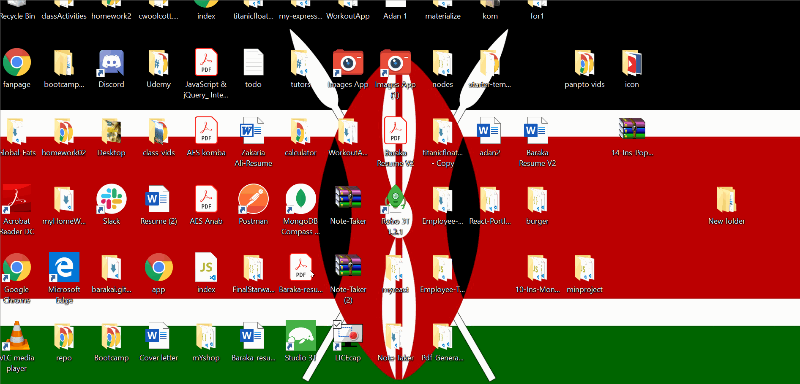

**Weather Dashboard**

**Description**

This weather dashboard application is used to retrieve weather data from OpenWeather API based on a search of a specific city.

Link to Application can be found [here](https://barakai.github.io/homework06/)

**Features**

This application was created using HTML, CSS, API and JavaScript . The following are rendered when a city is searched: city, date, icon image, temperature, humidity, wind speed, and UV index.

The application will also display a 5-day forecast that includes the date, icon image, temperature and humidity.

A search history is formed, so whenever searching for a new city, a button will appear with the city name. The city button can be clicked on for quick reference back to that city's weather information.

